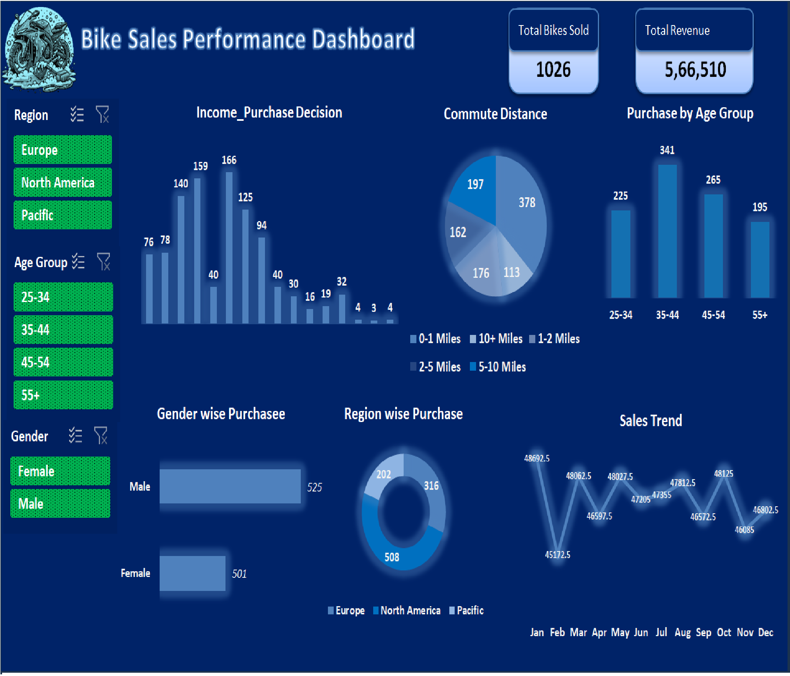

# 🚴‍♂️ Bike Sales Dashboard Project

## 📊 Overview
The **Bike Sales Dashboard** is an interactive Excel analytics solution designed to analyze and visualize customer purchasing trends in the bike industry.  
It provides insights into how **income, gender, age, and commute distance** influence purchasing decisions.

---

## 🧠 Features
- **Bar Charts** – Compare *income levels* vs *purchase decisions*  
- **Pie Charts** – Visualize *commute distance distribution*  
- **Column Charts** – Show *bike purchases by age bracket*  
- **Stacked Charts** – Analyze *gender-based purchasing trends*  
- **Pivot Tables** – Summarize data and support slicer-driven filtering  
- **Interactive Slicers** – Filter by *Gender*, *Region*, and *Age Bracket*  

---

## 💼 Dashboard Insights
- Higher-income groups show stronger purchasing trends.  
- Middle-age customers (31–45) contribute the most bike purchases.  
- Commute distances between 1–5 miles dominate purchase decisions.  
- Male and female purchase behavior shows notable differences.

---

## 🌱 Future Enhancements
- Add **predictive analytics** to forecast future sales trends.  
- Integrate with **real-time data sources** for live updates.  
- Expand analysis with **geographical visualizations**.  
- Transition to **Power BI or Tableau** for automation and deeper analytics.  

---

## 📸 Original Dashboard Preview

## 📸 Enhanced Dashboard Preview

---

## 🔗 Author
- Created by **[Girish Kumar V]**
- 📧 Contact: [girishaquarius@gmail.com]
---
⭐ If you find this useful, consider giving this repo a star!
